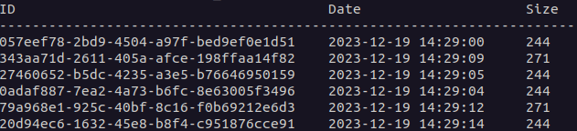
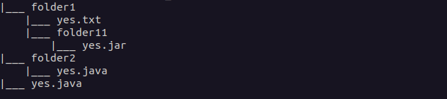

# sauvegardeur

Une application de sauvegarde externalisée.

## Contexte

L’objectif est de réaliser une application de sauvegarde externalisée, qui va faciliter la vie à l’utilisateur.

Il s’agit d’une application client-serveur en réseau, qui doit satisfaire aux règles suivantes :

- L’utilisateur choisi le nom du dossier à partir duquel il veut faire la sauvegarde, il entre l’adresse IP du serveur et la sauvegarde démarre.
- L’application cliente ne sauvegarde pas tous les fichiers du dossier, mais seulement ceux dont les propriétés (suffixes) sont décrites dans un fichier de paramètres, prédéfini. L’application, sauvegarde toute l’arborescence depuis le nom de dossier indiqué.

## Utilisation

### Déploiement du serveur

Le serveur est prêt à être déployé. Pour cela, peut entrer les commandes suivantes : 

```shell
docker build . -t serveur
docker run -p 80:555 serveur
```

Il est évidemment possible de choisir un autre port pour l'hôte, remplacez selon vos besoins.

Le serveur propose une API web permettant la sauvegarde, la restauration et la visualisation des fichiers. On peut interagir avec cette API par les extrémités : 

- `GET /saves` : renvoie un objet contenant l'ensemble des sauvegardes, avec leur id, leur date de création et leur poids. Exemple : 

```json
{
  "directories": [
    {
      "creation_time": "2023-12-19 14:29:00",
      "id": "057eef78-2bd9-4504-a97f-bed9ef0e1d51",
      "size": 244
    },
    {
      "creation_time": "2023-12-20 16:43:31",
      "id": "343aa71d-2611-405a-afce-198ffaa14f82",
      "size": 271
    }
  ]
}
```

- `GET /save/<id>` : Renvoie une version empaquetée en `.zip` de la sauvegarde d'identifiant `<id>`.
- `GET /save/<id>/tree` : Renvoie l'arborescence de la sauvegarde d'identifiant `<id>`. Par exemple : 

```
|___ folder1
    |___ yes.txt
    |___ folder11
        |___ yes.jar
|___ folder2
    |___ yes.java
|___ yes.java
```

- `POST /upload` : Avec un fichier `.zip` dans le corps de la requête, demande au serveur de sauvegarder la structure.

### Utilisation du client

Le client s'utilise comme une interface en ligne de commandes exécutée depuis python : 

```shell
python3 client.py
```

On peut aussi utiliser le gestionnaire de paquets *pip* afin d'installer l'application. Le script [`build.sh`](./client/build.sh) s'en occupe.

Ce client propose différentes options. Pour chacune d'entre elles, on peut préciser l'adresse et le numéro de port du serveur; par défaut, on considère qu'on envoie au serveur `localhost:80`. De la mème manière, le `-h` ou `--help` donnera des indications sur l'utilisation de l'option. 

#### `save`

Envoie un dossier au serveur pour le sauvegarder.

Utilisation : 

```shell
sauvegardeur save [-e FICHIER] [-s ADRESSE] [-p PORT] dossier
```

Avec : 

- `FICHIER` : le fichier contenant les extensions de fichier à sauvegarder (exemple dans [ce fichier](./client/extensions)). S'il n'est pas renseigné, envoie tous les fichiers au serveur.
- `dossier` : le dossier à sauvegarder

#### `ls`

Liste les sauvegardes disponibles.

Utilisation : 

```shell
sauvegardeur ls [-s ADRESSE] [-p PORT]
```

On aura un retour comme : 



#### `tree`

Affiche l'arborescence d'une sauvegarde donnée.

Utilisation : 

```shell
sauvegardeur tree [-s ADRESSE] [-p PORT] id
```

Avec : 

- `id` : l'identifiant, ou les premiers caractères de l'identifiant de la sauvegarde.

On aura un retour comme : 



#### `restore`

Restaure la sauvegarde donnée.

Utilisation : 

```shell
sauvegardeur restore -d DESTINATION [-s ADRESSE] [-p PORT] id
```

Avec : 

- `DESTINATION` : le dossier de destination pour la restauration de la sauvegarde.
- `id` : l'identifiant, ou les premiers caractères de l'identifiant de la sauvegarde.